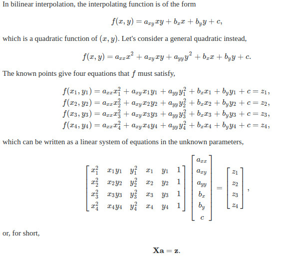
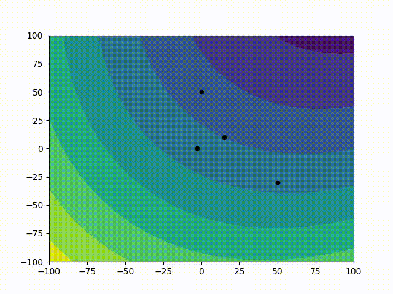

## Fast-Spatial-Interpolation-for-Irregular-Grid

This is C library for bilinear (biquadratic) interpolation for the scattered points (irregular grid) based on this discussion https://math.stackexchange.com/questions/828392/spatial-interpolation-for-irregular-grid

#### The library uses the explicit solution, thus avoiding an expensive linear solver step.



This library was used to only create an interpolation stencil in Watershed project, so there is no standard api at the moment.

I provided an example how to make an interface for linking the shared C library in python code and to create a demostration

To create a shared C lib:

```
 gcc -fPIC -O3 -shared -o bilinear.so bilinear.cpp
 ```

To get animation:

```
python test.py
```

